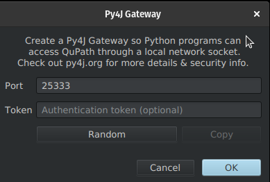

# QuPath Py4J extension 🐍

This extension aims to provide a link between QuPath and Python using [Py4J](https://www.py4j.org/)

## Installation

If you're using QuPath v0.6.0-rc3 (release candidate 3), then you don't need to install this --- it's included by default.

You can install this extension the same as other QuPath extensions,
as described in [the docs](https://qupath.readthedocs.io/en/latest/docs/intro/extensions.html#installing-extensions).

Usually this involves using the built-in extension manager, or by downloading
a build of the extension from [the releases](https://github.com/qupath/qupath-extension-py4j/releases)
and dragging this onto a QuPath window.

## Usage

To start a Py4J gateway from QuPath, you can either click the Python icon on
the QuPath toolbar, or use the menu item
`Extension -> Py4J -> Start Py4J Gateway`.

This dialog allows you to specify the port used for the websocket connection,
and an optional authentication token:



Once a gateway is started, you can connect from a Python process using
[qubalab](https://github.com/qupath/qubalab/):

```python
from qubalab.qupath import qupath_gateway
gateway = qupath_gateway.create_gateway(port=25333)

gateway.getExtensionVersion() # query the verison of the QuPath Py4J extension
```

Further documentation can be found in the [qubalab project](https://github.com/qupath/qubalab/).

## Development

It's recommended to use the extension setup described in
[the QuPath extension template](https://github.com/qupath/qupath-extension-template?tab=readme-ov-file#set-up-in-an-ide-optional)
for this extension.

